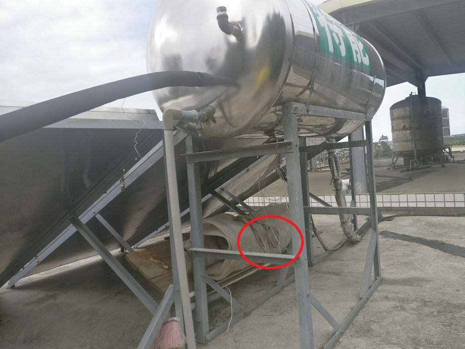
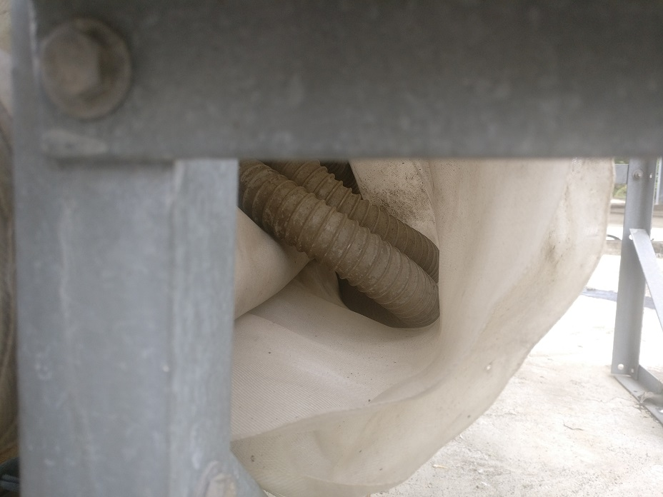
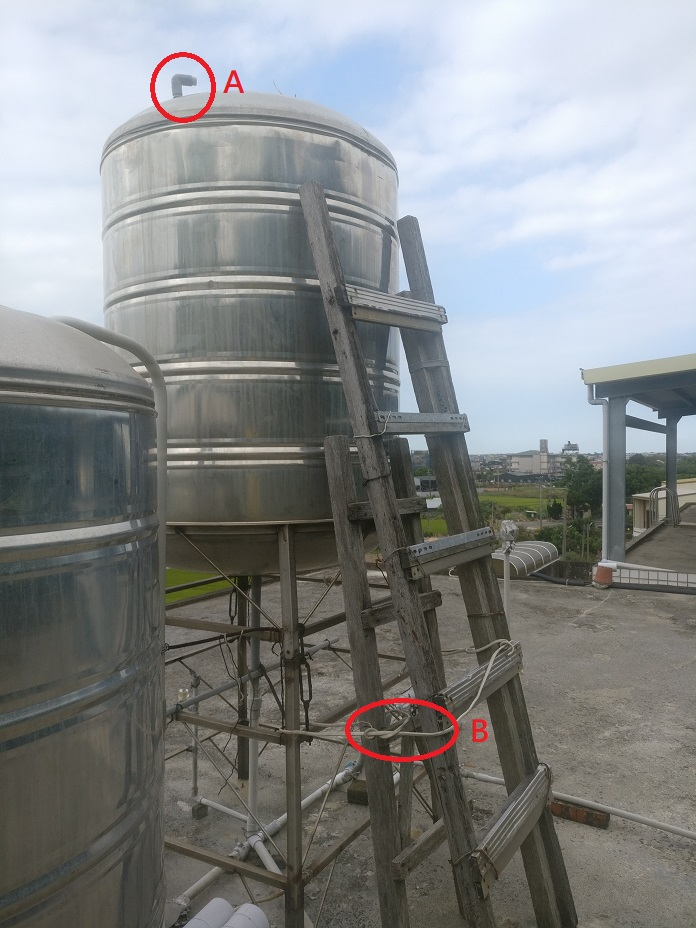
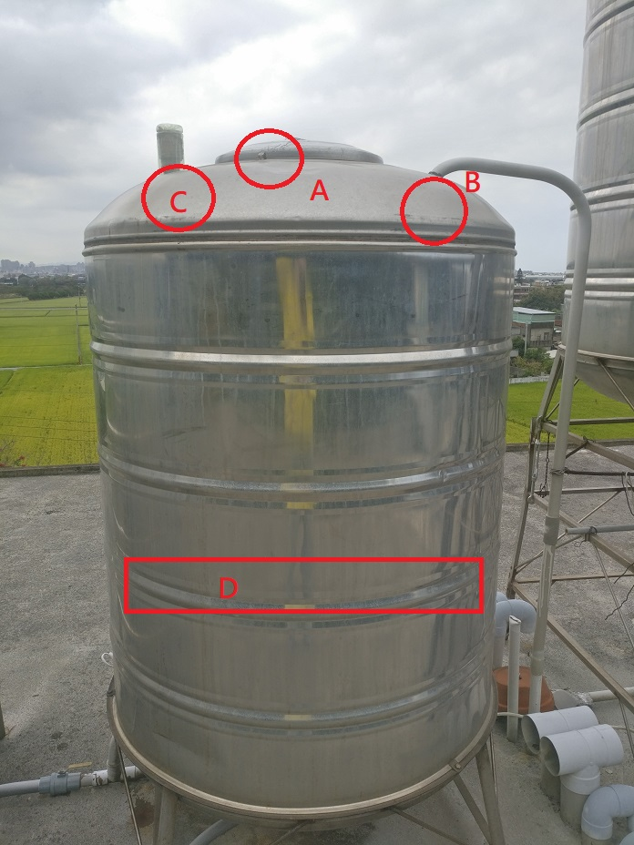

# 竹北水塔沒水之處理方式
[原網址](https://github.com/fg29/fg29.github.io/blob/master/index.md)

[短網址](https://fg29.github.io/)
## 導引地下水進水塔

* 使用時機 
  * 有電, 但水壓低導致水塔無儲水, 臨時補水供熱水器燒水洗澡
  * 地下水源, 建議僅作洗澡使用, 不要打過多進水塔
## 步驟
 1. 解開繩索拿取水管
      
      
 2. 拔開自家水塔入水的塞子，接上步驟1水管相同形狀那頭 (A)
 3. 解開綁樓梯的繩索，拿短梯架在一旁的水塔 (B)
      
 4. 爬上水塔, 解開蓋子上鐵絲 (A)
 5. 開蓋後, 由內部接上步驟1水管另一端 (B)
 6. 由內拉出兩段深水馬達浮筒, 使之垂掛在水塔邊上, 此時馬達會開始打水進水塔 (C)
 7. 自家水塔(標錯圖了)水打到需要深度後, 即可放回浮筒停止打水 (D)
 8. 還原以上
      

